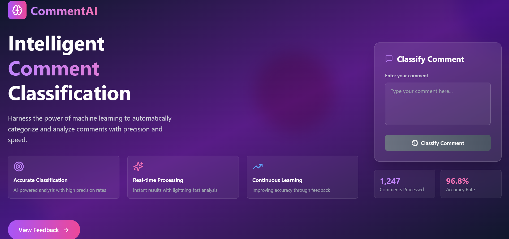

# ML-based Content Moderation Tool

A web-based application that uses machine learning to detect toxic comments in real-time. Built using a **Random Forest classifier with optimized thresholding**, this app provides fast and accurate classification of user-generated text as toxic or non-toxic.

---

## Demo




---

##  Features

-  Real-time comment classification
-  Supports multi-label toxicity categories
-  Lightweight and fast REST API with Flask
-  Modern frontend UI using React + Tailwind
-  Threshold-optimized Random Forest for better accuracy


## Tech Stack

### Frontend
- React.js
- Tailwind CSS
- Lucide Icons

###  Backend
- Python Flask
- Scikit-learn (Random Forest Classifier)
- Preprocessing (stopwords, stemming, vectorization)

---

## Project Structure

```
toxic-comment-classifier/
├── backend/
│   ├── app.py
│   ├── rf_thresholds.pkl
│   ├── rf_trained_models.pkl
│   └── requirements.txt
├── frontend/
│   └──
├── README.md
├── .gitignore
└── LICENSE
```

---

##  Installation

### Backend (Flask)

```bash
cd backend
pip install -r requirements.txt
```

 **Also run this once to download NLTK stopwords:**
```python
import nltk
nltk.download('stopwords')
```

```bash
python app.py
```

### Frontend (React)

```bash
cd frontend
npm install
npm start
```

---

## 📊 Model Details

- Model: Random Forest Classifier
- Features: TF-IDF vectorized text
- Threshold optimization done manually to improve precision-recall tradeoff
- Trained on publicly available dataset (e.g., Jigsaw Toxic Comments)

---

## 📝 Sample API Request

```bash
curl -X POST http://localhost:5000/classify -H "Content-Type: application/json" -d '{"comment": "You are so stupid"}'
```

```json
{
  "category": "toxic",
  "confidence": 92.14,
  "all_predictions": {
    "toxic": {
      "predicted": 1,
      "confidence": 92.14
    },
    ...
  }
}
```

---

## 📄 License

This project is licensed under the MIT License. See `LICENSE` for more information.

---

## 🙌 Acknowledgements

- [Jigsaw Toxic Comment Dataset](https://www.kaggle.com/c/jigsaw-toxic-comment-classification-challenge)
- [Flask](https://flask.palletsprojects.com/)
- [Create React App](https://create-react-app.dev/)